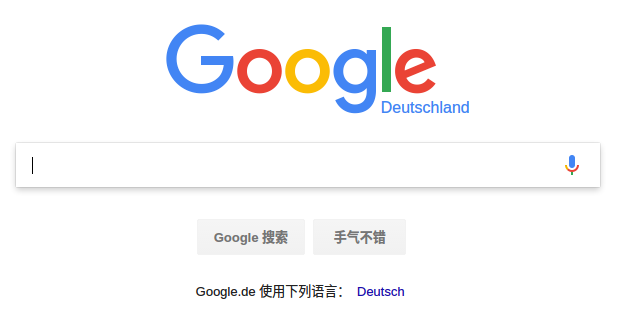

ShadowSocks客户端配置
######################

**1.安装**
    方法1:使用apt安装ShadowSocks
        
    >>> sudo apt-get install shadowsocks

    方法2:使用python的pip安装shadowsocks模块
    
    >>> apt-get install python-pip & pip install shadowsocks

**2.启动客户端**
    >>> sslocal -s 123.123.213.213 -p 6666 -b 127.0.0.1 -l 1080 -k 23333 -t 600 -m aes-256-cfb

**3.制作配置文件启动**
    2中的启动方法命令太长而且不便于管理，我们写成一个配置文件
    
    配置文件存为ss.conf，内容如下
    
.. code-block:: python

    {
        "server" : "hkvps.sharecode.pub",
        "server_port" : 60738,
        "local_port" : 1080,
        "password" : "PNzeYi",
        "timeout" : 600,
        "method" : "aes-256-cfb"
    }

**4.启动**
    >>> sslocal -c ss.conf

**5.配置浏览器**
    此时已经开启了ss，但是还需要在浏览器中设置代理，具体方法是
    设置Socks Host指向 ss客户端的本地IP和端口, 即127.0.0.1 1080

.. note::
    说明一下，SS不同于VPN，它是走socks5协议的，一般搭配浏览器使用，
    对于terminal的get,wget等走http是没有帮助的。虽然有socks转http的方法，但这里就不折腾了。

**6.特殊情况**
    在我的电脑的chrome浏览器中设置代理的时候提示以下内容:
    
提示内容::    
    在受支持的桌面环境中运行google-chrome时，将使用系统代理设置。但您的系统不受支持，或启动系统配置时出现问题。
    但您仍可通过命令行进行配置。如需详细了解各项实验功能和环境变量，请参见 man google-chrome。

解决方法::
    关闭该google-chrome，并重新从命令行启动，加入一个参数：
    
    >>> google-chrome --proxy-server="socks5://localhost:1080"

-----------------------------------

Google出来啦!

**参考网址**

https://zhidao.baidu.com/question/2075510983021560348.html
    
